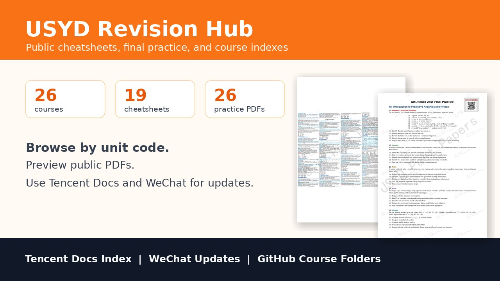
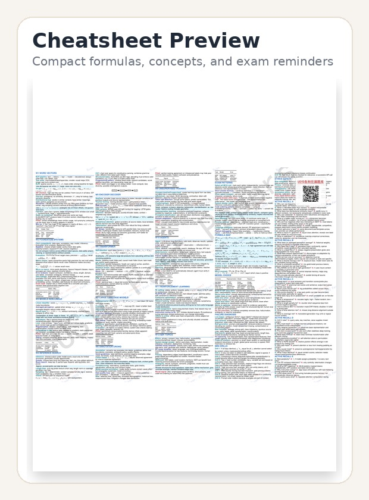
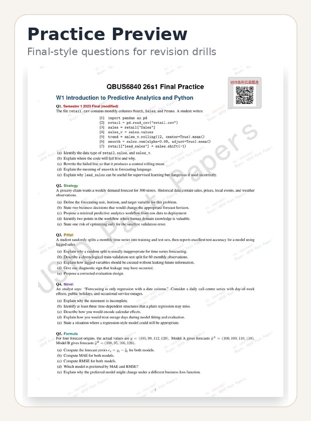

# USYD Revision Hub

  

  <a href="https://docs.qq.com/sheet/DRmNoZWp1V1dHY0Nu?tab=ss_52nz0g&viewId=vFP6At"><strong>Tencent Docs Index</strong></a> ·
  <a href="./courses/"><strong>Course Directory</strong></a> ·
  <a href="https://github.com/tomas-bear/USYD-Revision-Hub/issues"><strong>Report an Issue</strong></a>

悉尼大学复习资料公开索引。这里放的是筛选过的公开版 revision materials：cheatsheets、final practice PDFs、课程目录和更新入口。

> 完整资料状态、缺失课程申请、微信更新提醒：打开 [Tencent Docs Index](https://docs.qq.com/sheet/DRmNoZWp1V1dHY0Nu?tab=ss_52nz0g&viewId=vFP6At)。

## Start Here

| Need | Link |
| --- | --- |
| 查看完整资料表、更新状态、微信入口 | [Tencent Docs Index](https://docs.qq.com/sheet/DRmNoZWp1V1dHY0Nu?tab=ss_52nz0g&viewId=vFP6At) |
| 按课程代码找 PDF | [Course Directory](./courses/) |
| 反馈错误或申请补充课程 | [GitHub Issues](https://github.com/tomas-bear/USYD-Revision-Hub/issues) |

## Snapshot

Current public export for `26s1`: **26 courses**, **19 cheatsheets**, and **26 final-practice PDFs**.

  
  

| Material | What it is for |
| --- | --- |
| Cheatsheets | Compact formulas, definitions, concept maps, and high-frequency exam reminders. |
| Final Practice | Original final-style questions for timed revision and topic checks. |
| Course Index | One folder per unit code, with direct PDF download links. |
| Tencent Docs | Live tracker for updates, missing courses, and WeChat contact. |

## Course List

| Area | Course | Cheatsheet | Practice |
| --- | --- | --- | --- |
| Business / Analytics | [`BUSS6002`](./courses/BUSS6002/) Data Science in Business | Yes | Yes |
| Computer Science / Data / IT | [`COMP2123-COMP9123`](./courses/COMP2123-COMP9123/) Data Structures and Algorithms | Yes | Yes |
| Computer Science / Data / IT | [`COMP3308`](./courses/COMP3308/) Introduction to Artificial Intelligence | Yes | Yes |
| Computer Science / Data / IT | [`COMP5046`](./courses/COMP5046/) Natural Language Processing | Yes | Yes |
| Computer Science / Data / IT | [`COMP5310`](./courses/COMP5310/) Principles of Data Science | Yes | Yes |
| Computer Science / Data / IT | [`COMP5329`](./courses/COMP5329/) Deep Learning | - | Yes |
| Computer Science / Data / IT | [`COMP5339`](./courses/COMP5339/) Data Engineering | - | Yes |
| Computer Science / Data / IT | [`COMP5405`](./courses/COMP5405/) Digital Media Computing | Yes | Yes |
| Computer Science / Data / IT | [`COMP5425`](./courses/COMP5425/) Multimedia Retrieval | - | Yes |
| Computer Science / Data / IT | [`COMP9001`](./courses/COMP9001/) Introduction to Programming | Yes | Yes |
| Computer Science / Data / IT | [`COMP9003`](./courses/COMP9003/) Object-Oriented Programming | - | Yes |
| Computer Science / Data / IT | [`COMP9120`](./courses/COMP9120/) Database Management Systems | Yes | Yes |
| Computer Science / Data / IT | [`COMP9601`](./courses/COMP9601/) Computer and Network Organisation | - | Yes |
| Computer Science / Data / IT | [`DATA1001`](./courses/DATA1001/) Foundations of Data Science | Yes | Yes |
| Computer Science / Data / IT | [`DATA2001`](./courses/DATA2001/) Data Science, Big Data and Data Variety | Yes | Yes |
| Economics / Econometrics | [`ECON1001`](./courses/ECON1001/) Introductory Microeconomics | Yes | Yes |
| Economics / Econometrics | [`ECON1002`](./courses/ECON1002/) Introductory Macroeconomics | Yes | Yes |
| Engineering | [`ELEC5620`](./courses/ELEC5620/) Model Based Software Engineering | Yes | Yes |
| Computer Science / Data / IT | [`INFO5990`](./courses/INFO5990/) Professional Practice in IT | Yes | Yes |
| Computer Science / Data / IT | [`INFO6007`](./courses/INFO6007/) Project Management in IT | - | Yes |
| Math / Stats / Science | [`MATH1061`](./courses/MATH1061/) MATH 1A | Yes | Yes |
| Business / Analytics | [`QBUS3820`](./courses/QBUS3820/) Machine Learning and Data Mining in Business | - | Yes |
| Business / Analytics | [`QBUS6810`](./courses/QBUS6810/) Statistical Learning and Data Mining | Yes | Yes |
| Business / Analytics | [`QBUS6840`](./courses/QBUS6840/) Predictive Analytics | Yes | Yes |
| Math / Stats / Science | [`STAT5002`](./courses/STAT5002/) Introduction to Statistics | Yes | Yes |
| Math / Stats / Science | [`STAT5003`](./courses/STAT5003/) Computational Statistical Methods | Yes | Yes |

See the folder index in [Course Directory](./courses/) or the live tracker in [Tencent Docs](https://docs.qq.com/sheet/DRmNoZWp1V1dHY0Nu?tab=ss_52nz0g&viewId=vFP6At).

## How To Use

1. Open [Course Directory](./courses/) and find your unit code.
2. Download the available cheatsheet or final practice PDF.
3. Use these materials together with your official unit outline, Canvas material, lecture notes, and tutorial work.
4. For latest status, missing courses, or WeChat update reminders, open [Tencent Docs](https://docs.qq.com/sheet/DRmNoZWp1V1dHY0Nu?tab=ss_52nz0g&viewId=vFP6At).

## Tencent Docs / WeChat

The live tracker is maintained in [Tencent Docs](https://docs.qq.com/sheet/DRmNoZWp1V1dHY0Nu?tab=ss_52nz0g&viewId=vFP6At).

For WeChat update reminders, contribution feedback, and missing-course requests, scan the QR code below.

  

## Public Sharing Policy

This repository is for legal, independent revision. It is not a dump of raw course files.

Included materials should be one of:

- Original revision summaries or practice questions
- Public resource indexes
- Materials that are allowed to be shared publicly

Do not upload:

- Canvas-only lecture slides, tutorial sheets, solutions, recordings, or marking guides without permission
- Current assignments, quizzes, exams, or answers
- Unauthorized past paper originals or sample solutions
- Other students' notes, code, submissions, or personal information
- Anything intended for cheating, impersonation, or assessment misconduct

## Academic Integrity & Copyright

This repository is an independent student-made revision index and is not affiliated with, endorsed by, or maintained by the University of Sydney.

Use these materials for study and revision only. Always follow your unit coordinator's instructions, the University of Sydney Academic Integrity Policy, and copyright requirements.

If you are a copyright owner, instructor, or original author and believe something should not be public, please open an issue with the file path. After review, the material can be removed, replaced with a link, or updated with proper attribution.

## License

Unless otherwise stated, original text in this repository is shared under CC BY-NC-SA 4.0.

Third-party and university materials remain the property of their respective rights holders and are not automatically covered by this license.
